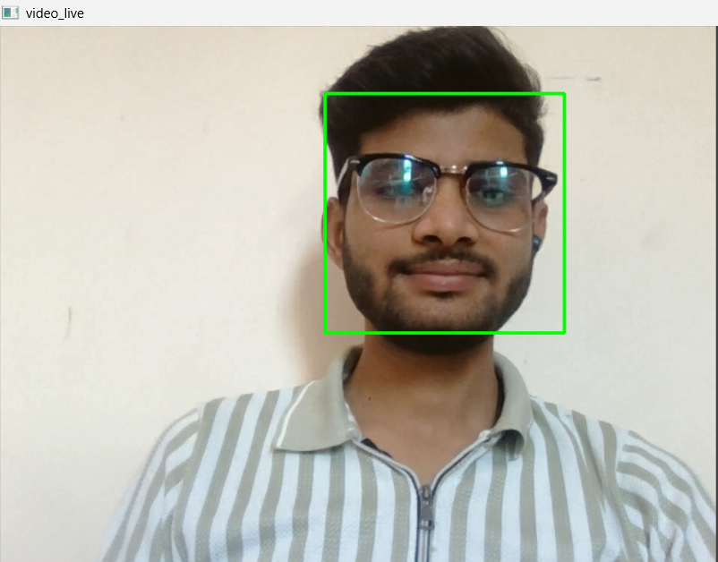

# 👨‍💻 Face Recognition-Based Attendance System

This project automates employee attendance using face recognition.
It captures the face using **OpenCV**, stores data into **MySQL**, and marks them as **Present**.

## 🔧 Technologies Used
- Python
- OpenCV
- MySQL

## 🚀 How It Works
1. System asks for employee name and address
2. Face is detected in live webcam using Haar Cascades
3. The employee is marked as "Present" and added to the database

## 📸 Output Screenshots

### ➤ Face Detection

  

---

### ➤ Terminal Output

  

## 📂 Files in this Repo
- `main.py` – Main file to run full system
- `face_detect.py` – Face detection and DB insert
- `mysql_connection.py` – DB connection
- `insert_data.py` – Insert employee data
- `create_table.py` – Create employee table
- `fetch_all_data.py` – Fetch all records

## 📄 License
This project is licensed under the MIT License – feel free to use and modify.

## 📌 Note
Make sure MySQL server is running and OpenCV is installed before running the project.

